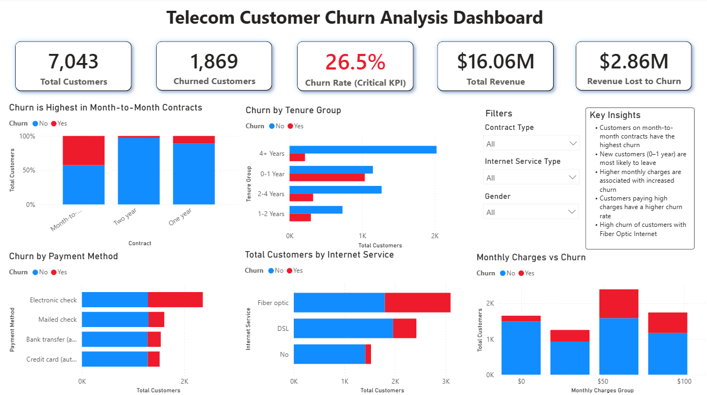

# 📊 Telecom Customer Churn Analysis & Prediction (Power BI + Python)

## 🔍 Project Overview

This project analyzes customer churn behavior in a telecom company, combining a Power BI dashboard with a Python-based machine learning model. The Power BI dashboard identifies key drivers of churn and provides actionable business insights. The Python component extends this by predicting individual customer churn probability using logistic regression, turning historical analysis into a forward-looking risk-scoring tool.

---

## 📁 Dataset

* Source: Kaggle (Telco Customer Churn Dataset)
* Records: 7,000+ customers
* Features: Customer demographics, services, charges, and churn status

---

## 🧠 Key KPIs

**Descriptive (Power BI Dashboard):**
* Total Customers: 7,043
* Churned Customers: 1,869
* Churn Rate: 26.5%
* Total Revenue: $16.06M

**Predictive (Python Model):**
* Model Type: Logistic Regression
* ROC-AUC: 0.842
* Precision: 65.8% | Recall: 56.7%
* Accuracy: 80.7% (vs. 73.5% naive baseline)

---

## 📊 Dashboard Features

* Churn analysis by Contract Type, Tenure Group, Payment Method
* Customer segmentation by Internet Service
* Monthly Charges impact on churn
* Interactive filters (Gender, Contract, Internet Service)
* Predictive Risk Scoring page — per-customer churn probability and risk tier (High/Medium/Low), powered by the Python model

---

## 💡 Key Insights

* Customers on month-to-month contracts show the highest churn rate
* New customers (0–1 year tenure) are more likely to churn
* Higher monthly charges are associated with increased churn
* Electronic check payment method shows higher churn behavior
* Model performance (ROC-AUC 0.842) shows these patterns are strong enough to reliably rank individual customers by risk, not just describe overall trends
* The predictive model identifies tenure as the single strongest retention factor, while Fiber optic internet service and TotalCharges are the strongest churn-risk drivers

---

## 🛠 Tools & Technologies

* Power BI (Data Modeling, DAX, Visualization)
* Power Query (Data Cleaning & Transformation)
* Excel (Initial Data Inspection)
* Python (pandas, scikit-learn) — data preprocessing, logistic regression model, evaluation metrics

---

## 📸 Dashboard Preview



---

## 🤖 Predictive Model (Python)

A logistic regression model was built to predict individual customer churn probability, extending the dashboard's descriptive insights into a forward-looking prediction.

**Pipeline:**
1. Data cleaning (handling blanks, removing identifier columns)
2. One-hot encoding of categorical features
3. 80/20 train-test split
4. Feature scaling (StandardScaler)
5. Logistic Regression training
6. Evaluation (Accuracy, Precision, Recall, ROC-AUC)
7. Export of per-customer churn probability scores for Power BI integration

**Files:**
* `churn_model_pipeline.py` — full end-to-end script
* `customer_churn_predictions.csv` — churn probability & risk tier per test customer
* `feature_importance.csv` — ranked feature weights

**How to run:**
```bash
pip install pandas scikit-learn joblib
python churn_model_pipeline.py
```

---

## 🚀 Business Recommendations

* Encourage long-term contracts with incentives
* Improve onboarding experience for new customers
* Review pricing strategy for high-charge segments
* Promote secure and convenient payment methods
* Use the model's risk tiers to prioritize retention outreach — focus limited resources on High Risk customers first, rather than treating all customers equally

---

## 👤 Author

Shahbaz | Data Analyst | PL-300 Certified | TDS-C01 Certified
